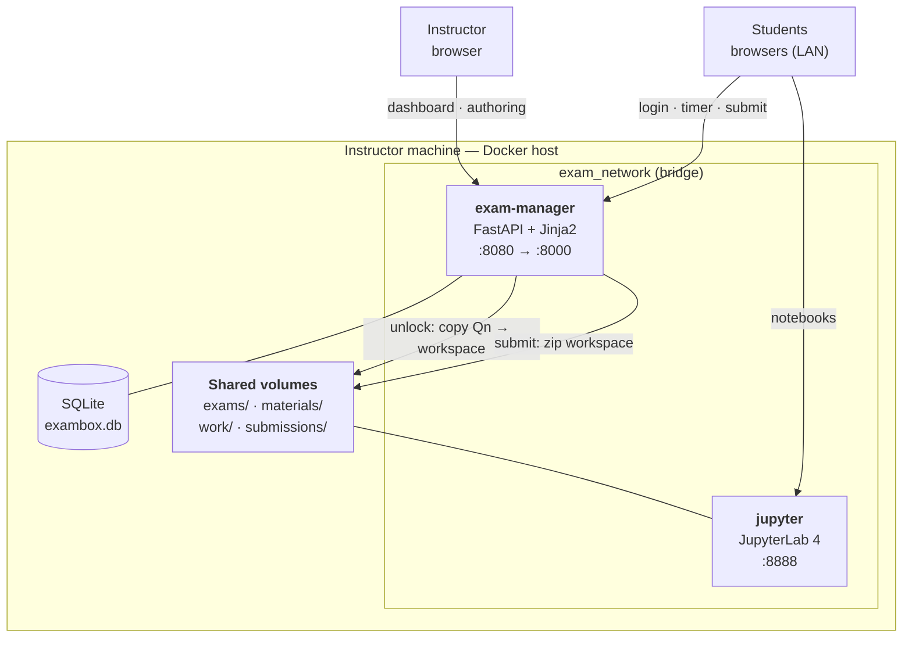

# ExamBox

**A self-hosted, Docker-based platform for running practical programming exams on a local network.**

Instructors author exams, monitor every student live, grant extra time, and unlock questions on the fly. Students work in a browser-based JupyterLab environment with a fixed, reproducible library set — no local setup, no dependency drift, no "it worked on my machine".

[](#academic-context)
[](#academic-context)
[](https://docs.docker.com/compose/)
[](https://www.python.org/)
[](https://fastapi.tiangolo.com/)
[](https://jupyterlab.readthedocs.io/)
[](LICENSE)

---

## Table of Contents

- [Why ExamBox](#why-exambox)
- [Features](#features)
- [Architecture](#architecture)
- [Tech Stack](#tech-stack)
- [Quick Start](#quick-start)
- [Usage](#usage)
- [Configuration](#configuration)
- [Data Model](#data-model)
- [API Reference](#api-reference)
- [Project Structure](#project-structure)
- [Known Limitations](#known-limitations)
- [Roadmap](#roadmap)
- [Academic Context](#academic-context)
- [License](#license)

---

## Why ExamBox

Practical exams in data science courses have a recurring infrastructure problem: every student machine is different. Library versions drift, installs fail mid-exam, and grading a submission means reconstructing the environment it was written in.

ExamBox removes that class of problem by making the environment part of the exam. The runtime is a pinned Docker image, so every student runs the same Python, the same `pandas`, the same `scikit-learn`. Submissions arrive as a ZIP archive at a single, predictable location on the instructor's machine, and the whole system runs on a LAN with no cloud dependency, no accounts, and no external services.

It's built to be started with one command and torn down just as easily.

## Features

**For instructors**

- **Exam authoring** — Create exams with a title, subject, duration, and an arbitrary number of questions.
- **Question editor** — Write descriptions in Markdown, provide starter code, attach datasets (CSV, JSON, images), and upload a PDF statement per question.
- **Notebook generation** — Turn a question's metadata into a ready-to-run `.ipynb` from the UI; title and description become Markdown cells, starter code becomes the first code cell.
- **Live dashboard** — Poll every student's status, current question, unlocked questions, and remaining time.
- **Mid-exam controls** — Grant extra minutes to an individual, unlock the next question for one student or for everyone at once, or force a submission.
- **Centralized submissions** — Every workspace is zipped and stored under `data/submissions/<exam>/<student>/<timestamp>.zip`, downloadable from the browser.

**For students**

- **Zero setup** — A browser is the only requirement. JupyterLab is served by the platform.
- **Reproducible environment** — A pinned scientific Python stack: `pandas`, `numpy`, `matplotlib`, `seaborn`, `scipy`, `scikit-learn`.
- **Progressive disclosure** — Questions appear as folders (`Q1/`, `Q2/`, …) only once the instructor unlocks them.
- **Reference materials** — Read-only course notes mounted into the workspace.
- **Live timer** — A countdown backed by server-side time, so it survives a page refresh.

## Architecture

Two services on a Docker Compose network. The exam manager owns all state and orchestration; JupyterLab is the student-facing execution environment.



**Request flow.** A student registers through the exam manager, which creates a `StudentSession`, provisions their workspace directory, copies in `Q1`, and stamps a server-side `end_time`. The student is handed a JupyterLab URL and works there. Unlocking a question is a filesystem operation: the manager copies `Q{n}` from the exam template into the student's workspace, where JupyterLab's file browser picks it up. Submitting walks the workspace, writes a ZIP into `data/submissions/`, and records a `Submission` row.

**Design note.** Questions are unlocked by *copying folders into a workspace* rather than by gating an API. This means the mechanism keeps working regardless of what the student does inside the notebook, and it leaves the submission as a plain directory tree — trivially inspectable and gradeable without the platform running.

## Tech Stack

| Layer | Technology |
|---|---|
| API & web UI | FastAPI 0.104, Jinja2, Uvicorn |
| Persistence | SQLAlchemy 2.0 (async), SQLite via `aiosqlite` |
| Validation | Pydantic v2 |
| Student runtime | JupyterLab 4.0, pandas, numpy, matplotlib, seaborn, scipy, scikit-learn |
| Packaging | Docker, Docker Compose, Python 3.11 slim images |
| Frontend | Server-rendered Jinja2 templates, vanilla JavaScript |

## Quick Start

### Prerequisites

- Docker Desktop (or Docker Engine) with Compose v2
- 4 GB of available RAM

### Run

```bash
git clone https://github.com/cofrian/Exam_Box.git
cd Exam_Box
docker compose up --build
```

First build takes a few minutes while the scientific Python stack is installed. Once it's up:

| Interface | URL |
|---|---|
| Instructor panel | <http://localhost:8080> |
| Student login | <http://localhost:8080/student> |
| JupyterLab | <http://localhost:8888> |
| API docs (Swagger) | <http://localhost:8080/docs> |
| Health check | <http://localhost:8080/health> |

To stop: `docker compose down`. Exams, materials, and submissions live in `data/` on the host and survive teardown.

### Running an exam over a LAN

Start the stack on the instructor's machine, find its IP (`ipconfig` on Windows, `ip addr` on Linux/macOS), and point students at it:

- Instructor: `http://<host-ip>:8080`
- Students: `http://<host-ip>:8080/student`

Port `8888` must also be reachable, since students' browsers connect to JupyterLab directly.

## Usage

### Instructor

1. **Create an exam** at `/professor/exams` — name, subject, duration, question count. Set *template folder* to a directory under `data/exams/` (e.g. `demo_python`) and *materials folder* to one under `data/materials/` (e.g. `apuntes_python`).
2. **Author the questions** via *Edit Questions*: Markdown description, starter code, attached datasets, PDF statement, and points. Use *Generate Notebooks* to produce the `.ipynb` files.
3. **Activate** the exam so it appears on the student login page.
4. **Monitor** from the dashboard: per-student progress, status, and remaining time.
5. **Intervene** as needed — `+5 min`, unlock the next question (per student or for all), or force a submission.
6. **Collect** from `/professor/submissions`, where each student's ZIP is listed and downloadable.

### Student

1. Open `/student`, pick the active exam, enter your ID and full name.
2. Click **Start Exam** to open JupyterLab with your workspace.
3. Work through the unlocked question folders. Save often.
4. Click **Submit** when done.

A bundled demo exam lives in `data/exams/demo_python/` (three questions, with a `ventas.csv` dataset) alongside course notes in `data/materials/apuntes_python/`, so you can exercise the full flow immediately. Open two incognito windows as two students to see the dashboard and unlock controls work live.

## Configuration

Copy `.env.example` to `.env` to override defaults.

| Variable | Default | Purpose |
|---|---|---|
| `DATABASE_URL` | `sqlite+aiosqlite:///./data/exambox.db` | Async SQLAlchemy connection string |
| `DATA_PATH` | `/app/data` | Root for exams, materials, workspaces, submissions (inside the container) |
| `JUPYTER_URL` | `http://localhost:8888` | JupyterLab base URL handed to students |
| `JUPYTER_TOKEN` | `exambox123` | JupyterLab auth token |
| `HOST_DATA_PATH` | *(unset)* | Host path to `data/`, used when spawning per-student containers (see [Roadmap](#roadmap)) |

### Customizing the student environment

Edit `student-image/requirements.txt` to change the available libraries, then rebuild:

```bash
docker compose build jupyter
```

Pinning versions here is what makes submissions reproducible — keep them pinned.

### Authoring exams on disk

An exam template is just a folder of question folders:

```
data/exams/my_exam/
├── Q1/
│   ├── question1.ipynb
│   └── dataset.csv
├── Q2/
└── Q3/
```

Reference it by folder name (`my_exam`) when creating the exam. Materials work the same way under `data/materials/`.

## Data Model

Four tables, managed with async SQLAlchemy.

| Model | Role |
|---|---|
| `Exam` | Exam definition — subject, duration, question count, template/materials folders, active flag |
| `Question` | A single question — title, Markdown description, instructions, starter code, attachments, PDF, points |
| `StudentSession` | One student's run — status, progress, unlocked count, `started_at` / `end_time`, extra minutes |
| `Submission` | A delivered archive — file path, size, timestamp, and whether it was auto-submitted |

Time is authoritative on the server: `end_time` is computed at session start and adjusted when extra minutes are granted, so the client-side countdown is only ever a display of server state.

## API Reference

Full interactive documentation is at `/docs` (Swagger UI) while the stack is running.

**Exams**

| Method | Endpoint | Description |
|---|---|---|
| `GET` | `/api/exams` | List all exams |
| `POST` | `/api/exams` | Create an exam |
| `GET` | `/api/exams/{id}` | Get an exam |
| `GET` | `/api/exams/{id}/full` | Get an exam with its questions |
| `POST` | `/api/exams/{id}/activate` | Open an exam to students |
| `POST` | `/api/exams/{id}/deactivate` | Close an exam |

**Questions**

| Method | Endpoint | Description |
|---|---|---|
| `GET` | `/api/exams/{id}/questions` | List an exam's questions |
| `POST` | `/api/questions` | Create a question |
| `PUT` | `/api/questions/{id}` | Update a question |
| `DELETE` | `/api/questions/{id}` | Delete a question and reorder the rest |
| `POST` | `/api/questions/{id}/upload` | Attach a file (dataset, PDF, image) |
| `POST` | `/api/questions/{id}/generate-notebook` | Generate the `.ipynb` for a question |

**Sessions & monitoring**

| Method | Endpoint | Description |
|---|---|---|
| `POST` | `/api/students/register` | Register a student for an exam |
| `POST` | `/api/students/{id}/start` | Start a session and provision the workspace |
| `GET` | `/api/students/{id}/status` | Session status and progress |
| `GET` | `/api/students/{id}/time` | Server-authoritative remaining time |
| `GET` | `/api/dashboard/{exam_id}` | Aggregated dashboard payload |

**Instructor actions & submissions**

| Method | Endpoint | Description |
|---|---|---|
| `POST` | `/api/actions/add-time` | Grant extra minutes |
| `POST` | `/api/actions/unlock-question` | Unlock the next question (one student or all) |
| `POST` | `/api/actions/force-submit/{id}` | Force a submission |
| `POST` | `/api/submit/{session_id}` | Submit an exam |
| `GET` | `/api/submissions/{exam_id}` | List an exam's submissions |
| `GET` | `/api/submissions/download/{id}` | Download a submission archive |

## Project Structure

```
Exam_Box/
├── docker-compose.yml           # Main stack: exam-manager + jupyter
├── docker-compose.dev.yml       # Variant that mounts the Docker socket
│
├── exam-manager/                # FastAPI backend and web UI
│   ├── app/
│   │   ├── main.py              # Routes and API endpoints
│   │   ├── models.py            # SQLAlchemy models
│   │   ├── schemas.py           # Pydantic schemas
│   │   ├── database.py          # Async engine and session factory
│   │   └── docker_manager.py    # Per-student container orchestration (not yet wired in)
│   ├── templates/               # Jinja2 templates (professor/, student/)
│   └── static/css/
│
├── student-image/               # JupyterLab image for students
│   ├── Dockerfile
│   ├── requirements.txt         # Pinned scientific Python stack
│   ├── jupyter_notebook_config.py
│   └── scripts/                 # entrypoint, unlock watcher, submit
│
└── data/                        # Host-persisted state
    ├── exams/                   # Exam templates (demo_python ships as an example)
    ├── materials/               # Read-only reference material
    ├── work/                    # Student workspaces
    ├── submissions/             # Delivered ZIP archives
    └── db/                      # SQLite database
```

## Known Limitations

Stated plainly, because knowing where a system's edges are is part of having built it.

- **One shared JupyterLab instance.** The shipped `docker-compose.yml` runs a single `jupyter` service that all students connect to, sharing one token and one mounted `work/` tree. Sessions, timers, progress, and submissions are tracked per student, but the *execution environment* is not isolated between them. `exam-manager/app/docker_manager.py` implements per-student container provisioning — unique token, port from a pool, 1 GB memory cap, 50% CPU quota — but `main.py` does not currently call it. See [Roadmap](#roadmap).
- **No network isolation.** `exam_network` is a standard bridge, so student containers reach the Internet. Making the network `internal: true` requires the per-student container work above, since the shared instance is reachable from student browsers on the host network.
- **No authentication.** The instructor panel is unauthenticated; students identify themselves by typing an ID. This is a deliberate trade-off for a trusted LAN in a proctored room, and it is the first thing to change for any other setting.
- **Environment control is not proctoring.** ExamBox controls what's inside the container. It cannot see the rest of the student's machine. High-stakes use needs real proctoring alongside it.
- **`pip_freeze.txt` is a stub.** The submission archive includes a placeholder rather than the environment's actual package list, because the manager can't currently introspect the student container. Real value depends on the per-student container work.
- **SQLite and polling.** Fine for a classroom (tens of concurrent students); the dashboard polls rather than pushing over WebSockets, and SQLite serializes writes. Neither would hold up at a larger scale.

## Roadmap

The natural next steps, in dependency order:

1. **Wire up per-student containers.** `docker_manager.create_student_container()` already exists and is ready to be called from the session-start endpoint, replacing the shared instance with one container per student, each with its own token, port, and resource caps.
2. **Isolate the network.** With per-student containers in place, mark the student network `internal: true` so the only reachable host is the exam manager.
3. **Real `pip_freeze`.** Run `pip freeze` inside the student container at submission time and bundle the true output.
4. **Instructor authentication.** Session-based login on `/professor/*`.
5. **Push-based dashboard.** Replace polling with WebSockets.
6. **Auto-submission on expiry.** Currently a session can run past `end_time` until it's force-submitted; a background task should close it out.

## Academic Context

Built for **IPD — Infraestructuras para el Procesamiento de Datos** (Data Processing Infrastructures), part of the **Data Science degree at Universitat Politècnica de València (UPV)**.

**Final grade: 10/10.**

The brief was to design and deploy a containerized, multi-service system. ExamBox uses the course material — image construction, Compose orchestration, volume and network design, service isolation, and resource limits — to solve an infrastructure problem the course itself has: running a practical exam where the environment is guaranteed identical for everyone and the results come back reproducible.

## License

[MIT](LICENSE) © Sergio Ortiz
